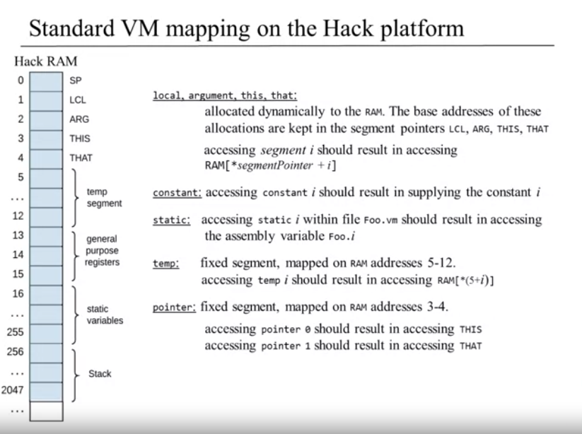
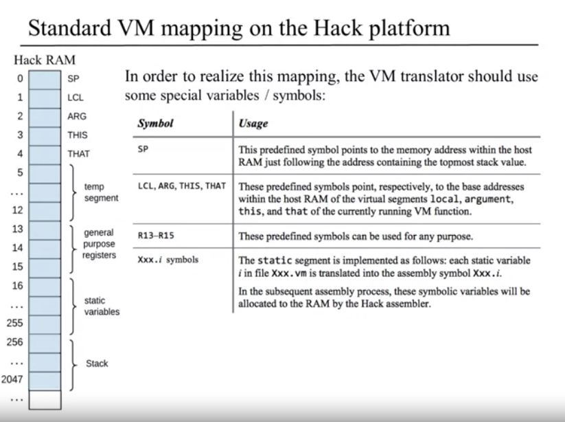

# VM translator 
VM translator that translates jack into hack assembly. 
Solution for https://www.nand2tetris.org/project07 and https://www.nand2tetris.org/project08

# Specification
## Memory segments

| Segment | Role | Memory Range            | Description                          |  
|----------|----------|-------------------------|--------------------------------------|
| Local | Function's local variables | Dynamically allocated   | Stores the function's local variables|
| Argument | Function's arguments | Dynamically allocated   | Stores the function's arguments      |
| This | Caller's 'this' | Dynamically allocated   | Stores the 'this' of the caller      |
| That | Caller's 'that' | Dynamically allocated   | Stores the 'that' of the caller      |
| Static | Static variables | RAM[16-255]             | Stores the static variables          |
| Constant | Constant values | Is not stored in memory | Stores the constant values [-32768,32767] |
| Temp | Temporary storage | RAM[5-12]               | Mapped directly to RAM locations 5-12, 8 slots |
| Pointer | Manipulate this & that | RAM[3-4]                | Used to manipulate the 'this' and 'that' pointers |
 




## Semantics
`push` segment index: Pushes the value of segment[index] onto the stack, where segment is argument, local, static, this, that, pointer, or temp and index is a nonnegative integer.
```
push local 0
```
`pop` segment index: Pops the top stack value and stores it in segment[index], where segment is argument, local, static, this, that, pointer, or temp and index is a nonnegative integer.
```
pop local 0
```
## Arrithmetic-logical commands

|cmd  |  op     | comment                               | Possible values     |
|-----|---------|---------------------------------------|---------------------|
|add  | x + y   | integer addition (two's complement)   |                     |
|sub  | x - y   | integer subtraction (two's complement)|                     |
|neg  | -y      | arithmetic negation (two's complement)|                     |
|eq   | x == y  | equality                              | -1 if true else 0   |
|gt   | x > y   | greater than                          | -1 if true else 0   |
|lt   | x < y   | less than                             | -1 if true else 0   |
|and  | x And y | bit-wise And                          |                     |
|or   | x Or y  | bit-wise Or                           |                     |
|not  | Not y   | bit-wise Not                          |                     |

```text
push constant 21
push constant 22
add
pop constant 21
```
Operations operate on top 2 elements in the stack


## Translation formulas
```
mem_segment1= {local,argument,this that}
push mem_segment1 i     addr=LCL+i; *SP=*addr; SP++; 
pop mem_segment1 i      addr=LCL+i; SP--; *addr=*SP

const:
push const i            SP=i; SP++
no pop

static: (right side - assembly)
- push static i       
@<file-name>.i
stack.push(M)

- pop static i 
D=stack.pop
@<file-name>.i
M=D


temp:
push temp i     addr=5+i; *SP=*addr; SP++; 
pop temp i      addr=5+i; SP--; *addr=*SP

pointer:
push pointer 0/1 *SP=THIS/THAT; SP++
pop pointer 0/1		SP--; THIS/THAT=*SP
0=this address
1=that address
```

TODO
- [x] Basic Loop test
- [ ] Fibonacci element
- [X] Fibonacci series
- [ ] Nested call
- [ ] Simple function
- [ ] Statics test